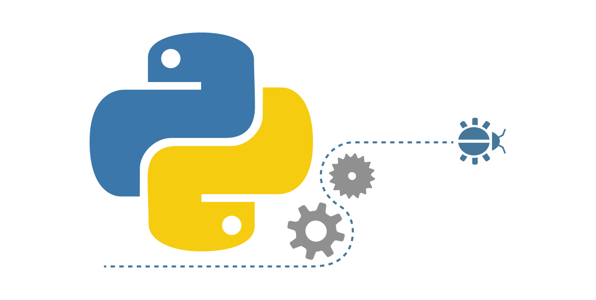

[Scroll Down](#end)

# PYTHON : 10 DAYS LEVEL-UP CHALLANGE

> **Welcome to 10 days of python levelup challange.**

## Introduction
Python level-up challange is made for level up your python skills on basics.

This challange contains 10 days. In Each days you will be introduced with a exercise which is more challanging than previous one. This will also help you to test your python basic skills. I will upload each exercise till 10 days with a solution file.

Those exercises includes my quick revision on my Python learning. 

Best Of Luck....

## Basic Setup

 
<a href="https://youtu.be/ouvOYElia1A?si=1ks-erhYc5OBW4vu">Python Installation</a>

 

 
<a href="https://youtu.be/ouvOYElia1A?si=1ks-erhYc5OBW4vu">VS Code Setup</a>

## Levels Uploaded Here

- [Level 1](/Level_1/)
- [Level 2](/Level_2/)
- [Level 3](/Level_3/)
- [Level 4](/Level_4/)
- [Level 5](/Level_5/)
- [Level 6](/Level_6/)
- [Level 7](/Level_7/)
- [Level 8](/Level_8/)
- [Level 9](/Level_9/)
- [Level 10](/Level_10/)

---

### Benefits of Completing the Challenge:

1. **Skill Enhancement:**
    - Strengthen your Python programming skills and gain confidence in tackling a variety of programming challenges.

2. **Practical Application:**
    - Apply your knowledge to build practical and useful programs, reinforcing your understanding of Python concepts in real-world scenarios.

3. **Problem-Solving Proficiency:**
    - Sharpen your problem-solving abilities by tackling diverse coding challenges and implementing efficient solutions.

4. **Project-Based Learning:**
    - Experience project-based learning by working on complete programs, fostering a deeper understanding of Python application development.

5. **Code Customization:**
    - Learn to customize and modify existing code to suit your requirements, a crucial skill in real-world development.

###### END

